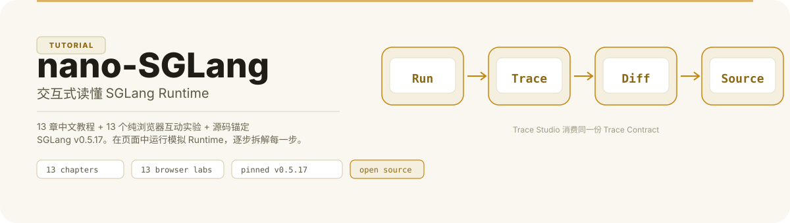
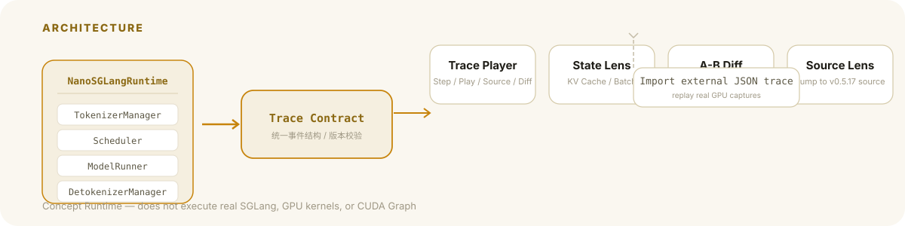

<p align="center">
  
</p>

## 它是什么

面向开发者与 AI 工程初学者的 **SGLang Runtime 交互式教程**。13 章中文教程 + 13 个纯浏览器互动实验，把一次请求完整拆解为 TokenizerManager → Scheduler → ModelRunner → DetokenizerManager 每一步。

教程源码阅读固定到 **SGLang v0.5.17**，避免 `main` 分支持续变化导致路径漂移。

## 为什么不一样

大多数教程要么只讲源码，要么只给黑盒 demo。本项目把两者绑在一起：

> **Run → Trace → Diff → Source**

在页面中运行共享的 **NanoSGLangRuntime**，由它产生统一 **Trace Contract**；动画、State Lens、A/B Diff 与 Source Lens 都消费同一份事件。Trace Studio 还支持导入外部 JSON trace，为后续真实 GPU 采集留出同一条回放路径。

<p align="center">
  
</p>

> 本项目是社区教程，与 SGLang / LMSYS 无官方隶属关系。Concept Runtime 不执行真实 SGLang、GPU kernel 或 CUDA Graph；仓库也不会把模拟 trace 冒充真实 GPU trace。

## 你将学到什么

| # | 主题 | 核心机制 |
|---|------|----------|
| 01 | 一次请求：先跑起来 | 端到端首跑 |
| 02 | Runtime 架构 | TokenizerManager · Scheduler · ModelRunner · DetokenizerManager |
| 03 | Request → ScheduleBatch → ForwardBatch | 状态如何在 CPU 与 GPU 之间传递 |
| 04 | Scheduler 与 Continuous Batching | 连续批处理原理 |
| 05 | RadixAttention / Radix Cache | 前缀树共享 KV |
| 06 | KV Cache 与 Paged Attention | 内存组织方式 |
| 07 | Prefill / Decode / Chunked Prefill | 三种执行模式 |
| 08 | Structured Outputs / Grammar | 约束生成 |
| 09 | Sampling Loop | 采样过程 |
| 10 | Speculative Decoding | 投机解码 |
| 11 | Overlap Scheduler | CPU-GPU 重叠调度 |
| 12 | Scale Out | TP / DP / EP / PD Disaggregation / HiCache |
| 13 | Capstone | 设计并解释一个 prefix-reuse 性能实验 |

每章包含：概念讲解 → 浏览器互动实验 → 源码定位 → 即时习题 → 动手任务。

## 快速开始

```bash
# 安装依赖
npm install

# 本地开发
npm run docs:dev
```

质量检查与生产构建：

```bash
npm run check          # 内容校验 + 运行时校验 + 实验校验 + VitePress 构建
npm run docs:preview   # 预览生产构建
```

## 部署到 GitHub Pages

```bash
bash scripts/publish-github.sh YOUR_GITHUB_USERNAME nano-sglang-interactive-guide
```

然后在 GitHub 仓库设置中启用 GitHub Actions 作为 Pages 源。每次 push 到 `main` 会自动构建并部署。`docs/.vitepress/config.mts` 会根据 `GITHUB_REPOSITORY` 自动计算 base path，仓库改名通常不需要手改配置。

## 教学原则

1. **First runnable, then readable.** 每个机制先让学习者看到状态变化，再解释源码。
2. **Simulation is labeled.** 概念模拟与真实 SGLang 执行严格分开。
3. **One mechanism, one lab.** 一个实验只解决一个认知问题。
4. **Source anchored.** 关键解释必须落到当前源码文件或官方文档。
5. **No fake benchmarks.** 性能数字必须记录版本、硬件、模型、输入分布与并发。
6. **Learn by perturbation.** 每章都让用户改变一个参数，观察系统行为变化。

## 参考上游

- [SGLang](https://github.com/sgl-project/sglang)
- [SGLang Docs](https://docs.sglang.io/)
- [Paper](https://arxiv.org/abs/2312.07104)

## License

教程代码与内容采用 [MIT License](./LICENSE)。SGLang 本身采用 Apache-2.0 License，版权归其贡献者所有。
